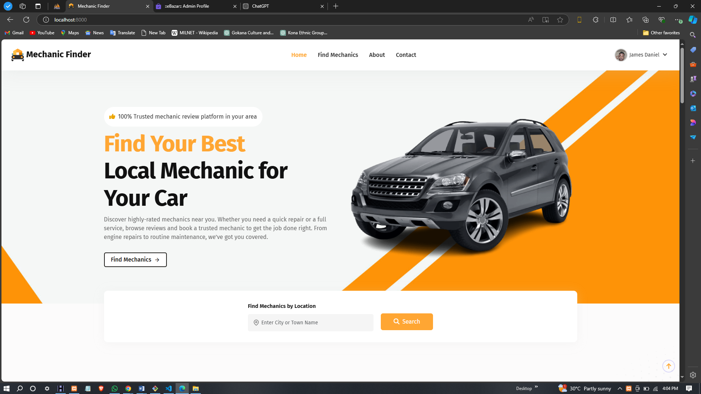
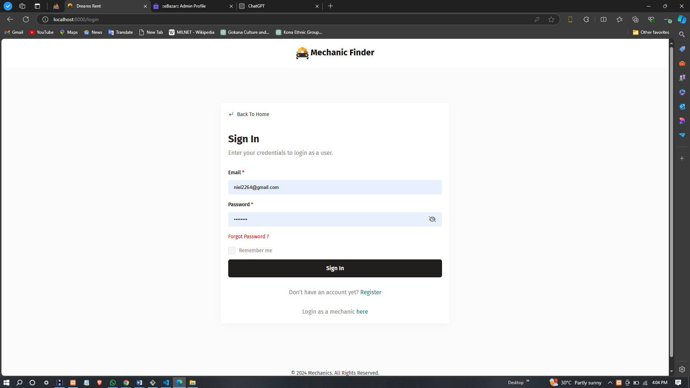
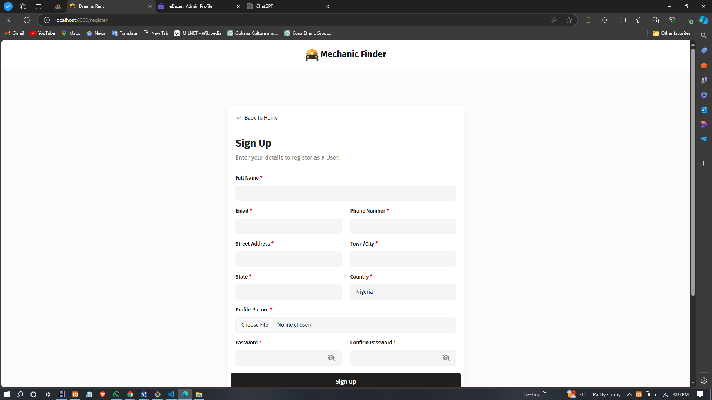
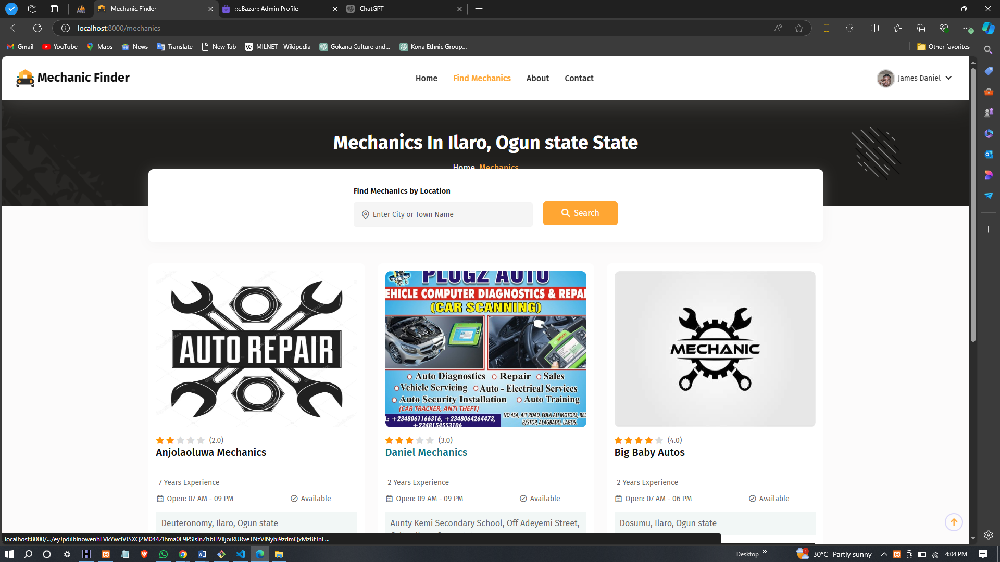
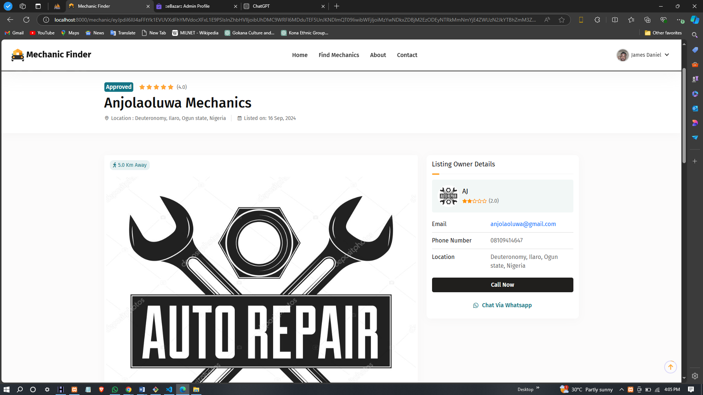
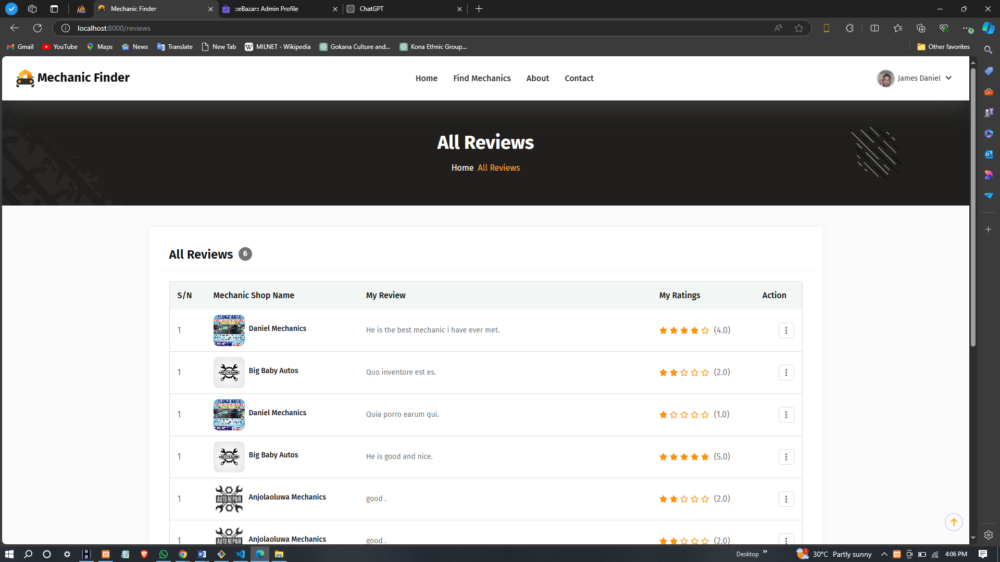

# DESIGN AND IMPLEMENTATION OF A WEBSITE FOR FINDING AND REVIEWING LOCAL MECHANICS

This project focuses on the design and implementation of a website that enables users to find and review local mechanics. The platform allows users to register, search for mechanics based on specific criteria like location and service type, and share their feedback through reviews. The website aims to offer a centralized hub for individuals seeking trustworthy, reliable mechanics by leveraging community input.

## Features

### 1. User Engagement and Registration

The platform offers an intuitive user registration and login system, enabling users to create an account or log in to an existing one. Once registered, users can take full advantage of the website's features, including searching for mechanics and submitting reviews. User engagement is essential for the platform's success, and by fostering an easy-to-use registration process, the website ensures a steady influx of new users. With the registration, users are empowered to contribute to the growing database of reviews, which will help guide future users in making informed decisions about mechanics.

This feature provides a personalized experience, allowing users to manage their profiles, track their review submissions, and receive updates based on their preferences. The goal is to create a vibrant community where users can interact with each other and share valuable insights.

### 2. Search Functionality

A key component of the platform is its search functionality, which enables users to find mechanics based on various filters such as location, service type, and rating. The search feature is designed to be both comprehensive and easy to use. By entering specific criteria, users can quickly view a list of local mechanics who meet their needs, eliminating the hassle of manual searching. 

The ability to narrow down search results by distance, service offered, or even user ratings ensures that users have a tailored experience when looking for service providers. The search functionality is a crucial part of the platform, as it helps users save time and effort in finding the right mechanic, leading to better user satisfaction.

The platform's search engine works efficiently with the underlying database, ensuring fast and accurate results even with a large number of mechanics listed on the site.

### 3. Review Submission and Feedback Mechanism

The website's review system is designed to facilitate the submission of feedback from users who have experienced services from local mechanics. Once a user has found a mechanic and received a service, they can rate their experience and submit a review detailing their thoughts. This review system plays a vital role in building a repository of information that future users can rely on when making decisions.

The review system encourages transparency by allowing users to share their experiences—whether positive or negative—about a mechanic’s service. This, in turn, creates a feedback loop where mechanics can improve their offerings based on the input from customers. It also allows users to view ratings and reviews from others, giving them the confidence to select a mechanic who has a proven track record of satisfying customers.

Additionally, the review mechanism is designed to be simple and intuitive, allowing users to quickly rate mechanics, write their review, and submit it with minimal effort. This ease of use ensures that users will be more likely to contribute reviews, which enhances the platform's value.

### 4. Performance and Optimization

The platform has been designed with performance in mind to ensure that users can access the website quickly and reliably. Fast load times are a critical factor in retaining users and ensuring a seamless experience. The website is optimized for performance, with efficient database queries and responsive page loading, even when many users are interacting with the platform simultaneously.

Load testing has been conducted to ensure that the website can handle a large volume of users without any significant slowdowns or downtime. The platform is designed to scale, ensuring that as the user base grows, performance remains optimal. The anticipation is that the website will be able to handle hundreds, if not thousands, of concurrent users with minimal delays.

The website’s speed and reliability are crucial in creating a positive user experience. Any delays or downtimes could frustrate users, potentially causing them to abandon the site. Therefore, significant emphasis has been placed on performance, which is expected to keep users engaged and encourage them to return.

### 5. User Satisfaction

User satisfaction is a cornerstone of the platform’s success. To assess how well the platform meets its objectives, user surveys and feedback mechanisms are in place. After using the platform, users are invited to provide their thoughts on their experience. This feedback will help gauge the website’s ease of use, effectiveness in finding local mechanics, and overall user satisfaction.

It is expected that most users will find the platform intuitive and helpful. By ensuring that the website provides a seamless user experience, with simple navigation and effective search and review features, the goal is to achieve high satisfaction rates. Users are expected to feel confident using the platform to find reliable mechanics, submit valuable reviews, and interact with other users.

In the long term, continuous monitoring of user feedback will provide the necessary insights for further refinement and enhancement of the platform. As more users join, the platform will evolve based on real-time user feedback to ensure it stays relevant and valuable.

## Screenshots

### Home Page  
_A visually appealing homepage featuring a slider showcasing promotions._  

### Login Page  
_A simple login page for users to access their accounts._  

### Register Page  
_The page for new users to create an account and join the platform._  

### Mechanic Listing  
_A list of local mechanics filtered by location and service type._  

### Mechanic Details Page  
_Showcasing detailed information about a selected mechanic, including services, location, and user reviews._  

### Review Page  
_The page where users can leave feedback and rate the mechanic based on their experience._  

## Conclusion

This project successfully meets its objectives by providing a platform for users to find and review local mechanics. The website’s features, such as user registration, search functionality, and review submission, enable users to make informed decisions when selecting mechanics. By fostering a community-driven platform, the website offers valuable insights that help improve the overall quality of automotive services.

The design and implementation of the website also ensure an efficient and reliable user experience. With fast load times, a user-friendly interface, and an intuitive design, the platform aims to enhance user satisfaction and encourage continued use. As the website grows, continuous improvements based on user feedback will ensure its success and relevance in the long term.

## Contact

For questions or feedback, please contact:  
Email: [niel2264@gmail.com](mailto:niel2264@gmail.com)
